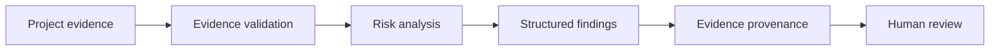

# IBRAMIND InfraRisk AI

**Evidence-first infrastructure risk intelligence for engineering and project teams.**

IBRAMIND InfraRisk AI is a public, hackathon-specific prototype created for the Nebius × NVIDIA Global AI Hackathon 2026. It turns supplied engineering/project evidence into structured risk findings with traceable evidence IDs, confidence, recommended actions, and human-review checkpoints.

> This repository is a public technical showcase. The production IBRAMIND Engineering Intelligence platform, customer data, enterprise controls, proprietary workflows, infrastructure, credentials, and private source code are not included.

## Why it matters

Infrastructure teams often make high-impact decisions from fragmented reports, site records, schedules, commercial evidence, and technical observations. InfraRisk demonstrates a bounded workflow that helps reviewers identify risk without inventing facts or hiding provenance.

## What the public prototype demonstrates

- FastAPI risk-analysis service
- Nebius-hosted NVIDIA/open model integration through an OpenAI-compatible API
- Structured risk-analysis schema
- Evidence-first prompting and citation requirements
- Confidence scoring and recommended actions
- Synthetic/anonymized infrastructure evidence only
- Reproducible benchmark workflow
- No production IBRAMIND secrets or customer data

## Commercial use / paid pilots

The open repository is the demonstrator. IBRAMIND can provide paid pilots and enterprise implementations around infrastructure risk, engineering evidence review, project controls, document intelligence, integrations, governance, and deployment.

**Request a paid pilot:** https://ibramind.com  
**Founder / partnership contact:** founder@ibramind.com

See [COMMERCIAL.md](COMMERCIAL.md) for the commercial boundary.

## Architecture

```
Engineering / Project Evidence
        ↓
Evidence Validation
        ↓
Risk Analysis
        ↓
Structured Findings + Provenance
        ↓
Human Review / Action
```

## 30-second demo

Use the included synthetic bridge-rehabilitation case:

```bash
cp .env.example .env
# add your own NEBIUS_API_KEY
uvicorn app:app --reload
curl -X POST http://127.0.0.1:8000/analyze-risk \
  -H 'Content-Type: application/json' \
  -d @data/example_project.json
```

The sample evidence deliberately includes access-scaffolding delay, critical-path pressure, and QA re-inspection constraints. The API returns structured findings with severity, confidence, evidence IDs, rationale, and recommended action.



## Where this becomes commercial

Typical paid-pilot scopes include one project or portfolio, a defined evidence set, a bounded risk taxonomy, agreed acceptance criteria, and a private review workflow. Success is measured using observable outputs such as schema validity, evidence-traceability, review completeness, response quality, and workflow fit — not unverified claims of engineering correctness.

See [PILOT.md](PILOT.md) for a sample engagement structure.

## Required environment variables

Copy `.env.example` to `.env` and provide your own credentials.

```bash
NEBIUS_API_KEY=
NEBIUS_BASE_URL=https://api.tokenfactory.nebius.com/v1/
NVIDIA_MODEL=<verified NVIDIA/Nemotron model ID returned by /v1/models>
```

Never commit credentials to this repository.

## Run locally

```bash
python -m venv .venv
source .venv/bin/activate
pip install -r requirements.txt
uvicorn app:app --reload
```

Then POST JSON to `/analyze-risk`:

```bash
curl -X POST http://127.0.0.1:8000/analyze-risk \
  -H 'Content-Type: application/json' \
  -d @data/example_project.json
```

## Reproducible benchmark

After configuring `NEBIUS_API_KEY`, run:

```bash
python scripts/benchmark.py
```

The benchmark discovers eligible NVIDIA/Nemotron models from the live Nebius API, runs synthetic infrastructure cases, validates evidence citations and structured output, records latency/token usage, and writes `artifacts/benchmark.json`.

The benchmark measures observable runtime and provenance behavior. It does not claim independent engineering correctness.

## Public/private boundary

Public here:
- Challenge-specific prototype code
- Synthetic/anonymized data
- Reproducible demo and benchmark artifacts
- Public technical documentation

Kept private:
- IBRAMIND production platform
- Customer/tenant information
- Proprietary commercial and engineering workflows
- Founder/owner control-plane logic
- Production infrastructure and secrets
- Enterprise integrations and governed deployment configuration

## Hackathon integrity

The pre-existing IBRAMIND platform is not represented as new hackathon work. Hackathon-period work in this repository includes the InfraRisk workflow, Nebius-hosted NVIDIA-model integration layer, evidence schema, evaluation cases, public documentation, and demo flow.

## Security

See [SECURITY.md](SECURITY.md). Please do not report vulnerabilities, credentials, or sensitive information in a public issue.

## License and brand

Prototype source code is licensed under the [MIT License](LICENSE). IBRAMIND names, logos, trademarks, private platform code, customer data, and commercial services are not granted by that license. See [TRADEMARK.md](TRADEMARK.md).

---

Built by **IBRAMIND Engineering Intelligence** — engineering intelligence for connected, governed, evidence-based infrastructure delivery.
